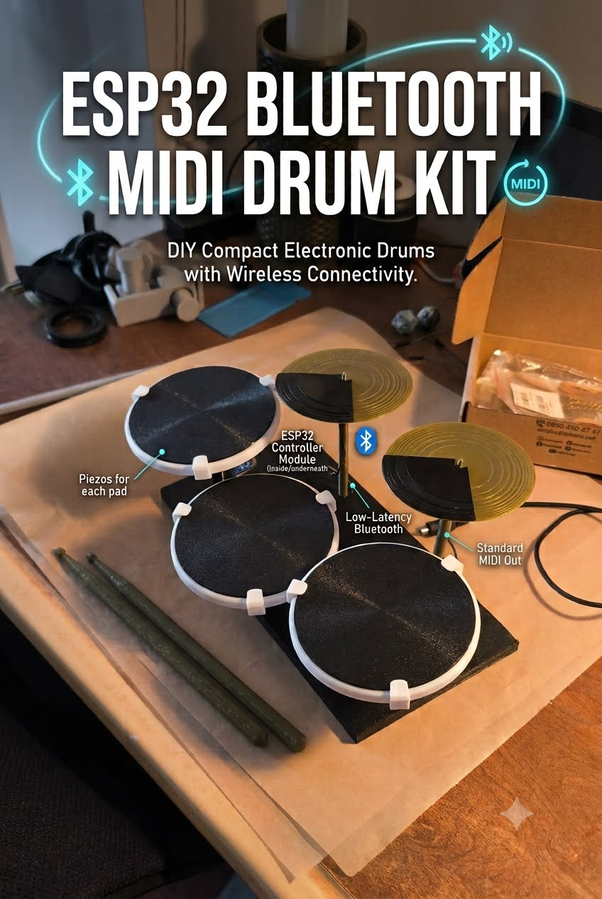

# ESP32-C3 Bluetooth MIDI Drum Kit

> 3D Printer ile basılmış, BLE MIDI ile kablosuz çalışan DIY elektronik davul seti.



[](https://makerworld.com/tr/models/3235210-drum-kit-using-esp32-bluetooth-midi)

## 🇹🇷 Türkçe

### Proje Hakkında

Bu proje, **ESP32-C3 Super Mini** mikrodenetleyicisi kullanılarak oluşturulmuş компакт bir elektronik davul setidir. 3D printer ile basılmış pad'ler, piezo sensörler ve Bluetooth Low Energy (BLE) MIDI bağlantısı ile çalışır.

### Ozellikler

- **5 Pad**: Kick, Snare, Hi-Hat, Tom, Crash Cymbal
- **BLE MIDI**: Kablosuz Bluetooth bağlantısı (düşük gecikme)
- **Velocity Sensitivity**: Vuruş şiddetine göre MIDI velocity
- **3D Baskı**: Tamamı 3D printer ile basılabilir gövde
- **Kompakt**: Masaüstü boyutunda, taşınabilir tasarım

### Önemli: Analog Pin Gerekliliği

Piezo sensörler **analog pinlere** bağlanır. Her piezo için bir analog pin gereklidir.

| Mikrodenetleyici | Analog Pin Sayısı | Maks. Pad |
|------------------|-------------------|-----------|
| ESP32-C3 Super Mini | 5 (GPIO0-4) | 5 pad |
| ESP32-WROOM-32D | 18 (GPIO32-39, GPIO0-5, GPIO34-39) | 18 pad |
| ESP32-S3 Super Mini | 20 | 20 pad |
| Arduino Uno | 6 (A0-A5) | 6 pad |
| Arduino Nano | 8 (A0-A7) | 8 pad |

> **Daha fazla pad istiyorsanız**: ESP32-WROOM-32D veya ESP32-S3 gibi daha çok analog pin'e sahip kartlar kullanarak 10-15 pad'li更大的鼓组 kurabilirsiniz. Kodda `NUM_PADS` sabitini ve `piezoPins` dizisini değiştirmeniz yeterlidir.

### Gerekli Malzemeler

| Bileşen | Adet | Not |
|---------|------|-----|
| ESP32-C3 Super Mini | 1 | USB-C girişli, dahili LED (GPIO8) |
| Piezo Sensör (27mm) | 5 | Her pad için bir adet |
| Direnç (1MΩ) | 5 | Pull-down direnç |
| Jumper Kablo | ~20 | Erkek-dişi |
| USB-C Kablo | 1 | Kod yükleme için |

### 3D Baskı Parçaları

[`drumkit.3mf`](3d-models/drumkit.3mf) dosyası 6 baskı plakası içerir:

| Plaka | Renk | İçerik |
|-------|------|--------|
| 01 | Beyaz | Pad çerçeveleri + klipsler |
| 02 | Siyah | Pad üst yüzeyleri (3 yuvarlak + 2 zil) |
| 03 | Siyah | Zil ayakları / tutucular |
| 04 | Yeşil | Zil üst yüzeyleri + klipsler |
| 05 | Siyah | Ana gövde (base plate) |
| 06 | Yeşil | Davul çubukları |

**Önerilen malzeme**: PLA veya PLA+ ( PETG de olur )

### Bağlantı Şeması

```
ESP32-C3 Super Mini
┌─────────────────┐
│                 │
│  GPIO0 ──────────── Piezo 1 (Kick)    + 1MΩ direnç
│  GPIO1 ──────────── Piezo 2 (Snare)   + 1MΩ direnç
│  GPIO2 ──────────── Piezo 3 (Hi-Hat)  + 1MΩ direnç
│  GPIO3 ──────────── Piezo 4 (Tom)     + 1MΩ direnç
│  GPIO4 ──────────── Piezo 5 (Cymbal)  + 1MΩ direnç
│                 │
│  GND ────────────── Piezo (-)         │
│                 │
│  USB-C ──────── Kod yükleme           │
└─────────────────┘

Not: GPIO8 - Dahili LED (devreye ekstra LED baglantisi gerekmez)
```

Detaylı bağlantı için: [docs/WIRING.md](docs/WIRING.md)

### Montaj

1. 3D parçaları bas
2. Piezo sensörleri pad'lere yapıştır
3. Kablo lehimleme / bağlama
4. ESP32'yi gövdeye yerleştir
5. Kodu yükle
6. Bluetooth ile bağlan

Detaylı montaj için: [docs/ASSEMBLY.md](docs/ASSEMBLY.md)

### Kod Yükleme

Arduino IDE ile:
1. ESP32 board paketini yükle
2. `firmware/drumkit/drumkit.ino` dosyasını aç
3. Board: "ESP32C3 Dev Module" seç
4. Upload

Detaylı yükleme için: [docs/FLASHING.md](docs/FLASHING.md)

### Bluetooth MIDI Kullanma

Cihaz adı: **ESP32-C3-Drum**

| Platform | Uygulama | Durum |
|----------|----------|-------|
| macOS | GarageBand | ✅ Doğrudan çalışır |
| macOS | Logic Pro | ✅ Doğrudan çalışır |
| iOS | GarageBand | ✅ Doğrudan çalışır |
| iOS | Cubasis 3 | ✅ Doğrudan çalışır |
| Android | n-track Studio | ✅ Doğrudan çalışır |
| Android | Caustic 3 | ✅ Doğrudan çalışır |
| Web | BandLab | ✅ BLE MIDI destekli |
| Web | Soundtrap | ✅ BLE MIDI destekli |
| Windows | loopMIDI + DAW | ⚠️ BLE-MIDI sürücü gerekli |

> **Not**: ESP32-C3 dahili LED (GPIO8) kullanır. Devreye ekstra LED bağlamanıza gerek yoktur.

Detaylı bağlantı ve uygulama kılavuzları için: [docs/BLUETOOTH.md](docs/BLUETOOTH.md)

---

## 🇬🇧 English

### About

A compact DIY electronic drum kit built with an **ESP32-C3 Super Mini** microcontroller. Features 3D-printed pads, piezo sensors, and wireless Bluetooth Low Energy (BLE) MIDI connectivity.

[](https://makerworld.com/tr/models/3235210-drum-kit-using-esp32-bluetooth-midi)


### Features

- **5 Pads**: Kick, Snare, Hi-Hat, Tom, Crash Cymbal
- **BLE MIDI**: Wireless Bluetooth connection (low latency)
- **Velocity Sensitivity**: MIDI velocity based on hit strength
- **3D Printed**: Fully printable body and pads
- **Compact**: Desktop-sized, portable design

### Important: Analog Pin Requirement

Piezo sensors connect to **analog pins**. Each piezo requires one analog pin.

| Microcontroller | Analog Pin Count | Max Pads |
|-----------------|------------------|----------|
| ESP32-C3 Super Mini | 5 (GPIO0-4) | 5 pads |
| ESP32-WROOM-32D | 18 (GPIO32-39, GPIO0-5, GPIO34-39) | 18 pads |
| ESP32-S3 Super Mini | 20 | 20 pads |
| Arduino Uno | 6 (A0-A5) | 6 pads |
| Arduino Nano | 8 (A0-A7) | 8 pads |

> **Need more pads?**: Use microcontrollers with more analog pins like ESP32-WROOM-32D or ESP32-S3 to build larger drum kits with 10-15 pads. Just change the `NUM_PADS` constant and `piezoPins` array in the code.

### Required Components

| Component | Qty | Note |
|-----------|-----|------|
| ESP32-C3 Super Mini | 1 | USB-C port, built-in LED (GPIO8) |
| Piezo Sensor (27mm) | 5 | One per pad |
| Resistor (1MΩ) | 5 | Pull-down resistor |
| Jumper Wires | ~20 | Male-to-female |
| USB-C Cable | 1 | For flashing |

### 3D Printed Parts

[`drumkit.3mf`](3d-models/drumkit.3mf) contains 6 build plates:

| Plate | Color | Contents |
|-------|-------|----------|
| 01 | White | Pad frames + clips |
| 02 | Black | Pad top surfaces (3 round + 2 cymbal) |
| 03 | Black | Cymbal stands / holders |
| 04 | Green | Cymbal top surfaces + clips |
| 05 | Black | Main base plate |
| 06 | Green | Drumsticks |

**Recommended material**: PLA or PLA+ (PETG works too)

### Wiring Diagram

```
ESP32-C3 Super Mini
┌─────────────────┐
│                 │
│  GPIO0 ──────────── Piezo 1 (Kick)    + 1MΩ resistor
│  GPIO1 ──────────── Piezo 2 (Snare)   + 1MΩ resistor
│  GPIO2 ──────────── Piezo 3 (Hi-Hat)  + 1MΩ resistor
│  GPIO3 ──────────── Piezo 4 (Tom)     + 1MΩ resistor
│  GPIO4 ──────────── Piezo 5 (Cymbal)  + 1MΩ resistor
│                 │
│  GND ────────────── Piezo (-)         │
│                 │
│  USB-C ──────── Flashing              │
└─────────────────┘

Note: GPIO8 - Built-in LED (no external LED connection needed)
```

For detailed wiring: [docs/WIRING.md](docs/WIRING.md)

### Assembly

1. 3D print all parts
2. Attach piezo sensors to pads
3. Solder / connect wires
4. Mount ESP32 into base
5. Flash the firmware
6. Connect via Bluetooth

For detailed assembly: [docs/ASSEMBLY.md](docs/ASSEMBLY.md)

### Flashing

Using Arduino IDE:
1. Install ESP32 board package
2. Open `firmware/drumkit/drumkit.ino`
3. Select board: "ESP32C3 Dev Module"
4. Upload

For detailed instructions: [docs/FLASHING.md](docs/FLASHING.md)

### Using Bluetooth MIDI

Device name: **ESP32-C3-Drum**

| Platform | App | Status |
|----------|-----|--------|
| macOS | GarageBand | ✅ Works out of the box |
| macOS | Logic Pro | ✅ Works out of the box |
| iOS | GarageBand | ✅ Works out of the box |
| iOS | Cubasis 3 | ✅ Works out of the box |
| Android | n-track Studio | ✅ Works out of the box |
| Android | Caustic 3 | ✅ Works out of the box |
| Web | BandLab | ✅ BLE MIDI supported |
| Web | Soundtrap | ✅ BLE MIDI supported |
| Windows | loopMIDI + DAW | ⚠️ BLE-MIDI driver needed |

> **Note**: ESP32-C3 uses built-in LED (GPIO8). No external LED connection needed.

For detailed connection and app guides: [docs/BLUETOOTH.md](docs/BLUETOOTH.md)

---

## 📁 Project Structure / Proje Yapısı

```
drumkit/
├── README.md              # This file / Bu dosya
├── LICENSE                # CC BY-NC-SA 4.0
├── firmware/
│   └── drumkit/
│       └── drumkit.ino    # Arduino code / Arduino kodu
├── 3d-models/
│   └── drumkit.3mf        # 3D print file / 3D baskı dosyası
├── docs/
│   ├── WIRING.md          # Wiring guide / Bağlantı rehberi
│   ├── ASSEMBLY.md        # Assembly guide / Montaj rehberi
│   ├── FLASHING.md        # Flashing guide / Kod yükleme rehberi
│   └── BLUETOOTH.md       # Bluetooth MIDI guide / Bluetooth rehberi
└── images/                # Documentation images / Görseller
```

## 📜 License / Lisans

**CC BY-NC-SA 4.0** (Creative Commons Atıf-GayriTicari-AyniLisanslaPaylaş 4.0 Uluslararası)

Bu eser:
- ✅ Kişisel/bireysel kullanım için özgürdür
- ✅ Atıf ile alıntı yapabilirsiniz
- ✅ Değiştirip türetebilirsiniz
- ✗ Ticari amaçla kullanılamaz
- ⚠️ Türev eserler aynı lisansla (CC BY-NC-SA 4.0) paylaşılmalıdır

Detaylı lisans için: [LICENSE](LICENSE)

## � Katkıda Bulunma

Hata bildirimi veya geliştirme önerileriniz için Issue açabilirsiniz.
