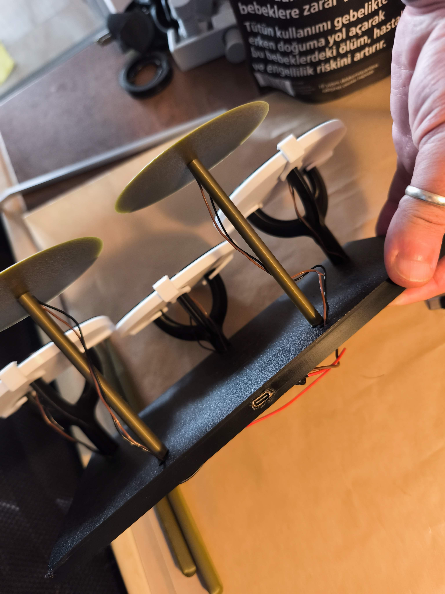
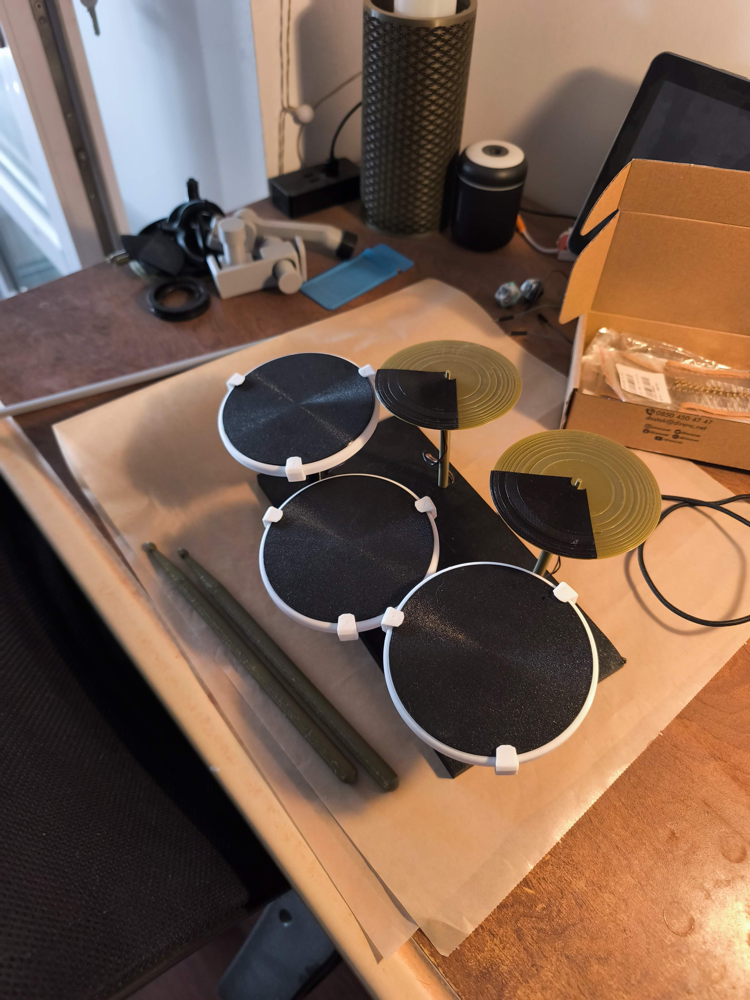
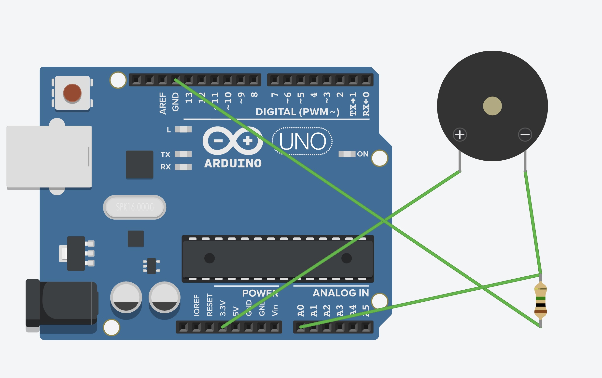
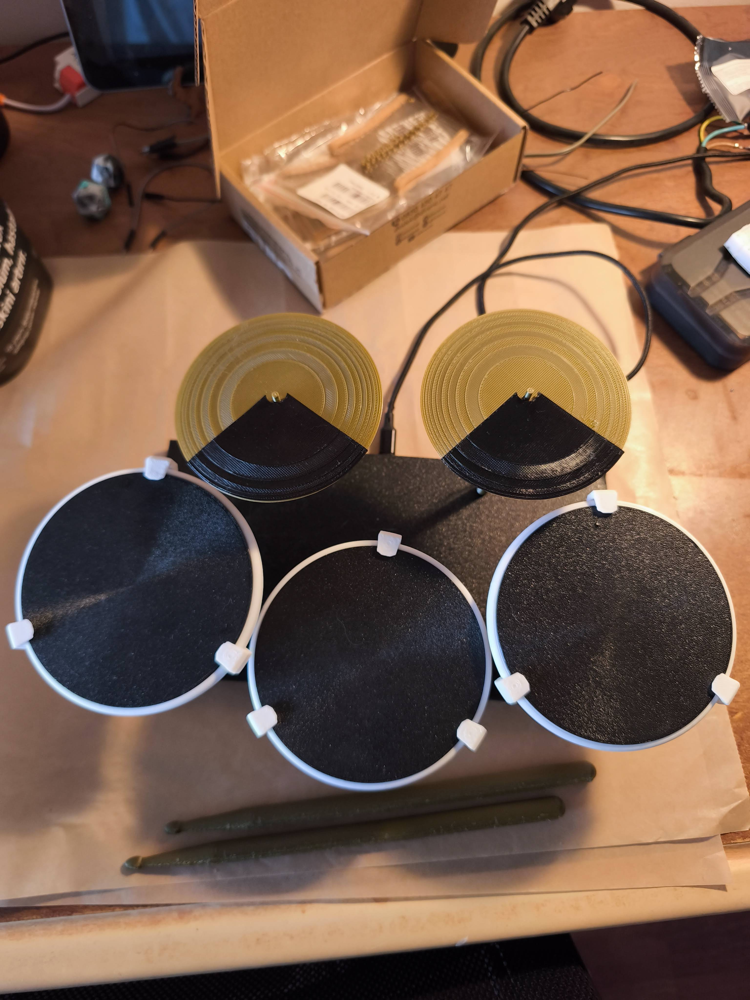

# Montaj Rehberi / Assembly Guide

## 🇹🇷 Türkçe

### Adım 1: 3D Baskı

[`drumkit.3mf`](../3d-models/drumkit.3mf) dosyasını Bambu Studio veya PrusaSlicer'da açın.

| Plaka | Renk | Parça | Adet |
|-------|------|-------|------|
| 01 | Beyaz | Pad çerçeveleri | 3 |
| 01 | Beyaz | Klipsler | 12 |
| 02 | Siyah | Yuvarlak pad üstleri | 3 |
| 02 | Siyah | Zil pad üstleri | 2 |
| 03 | Siyah | Zil ayakları | 2 |
| 04 | Yeşil | Zil üst yüzeyleri | 2 |
| 05 | Siyah | Ana gövde | 1 |
| 06 | Yeşil | Davul çubukları | 2 |

**Baskı Önerileri**:
- Malzeme: PLA veya PLA+
- Katman yüksekliği: 0.2mm
- Doluluk: %20-30
- Destek: Gerekli olabilir (zil ayakları için)

### Adım 2: Piezo Sensörleri Hazırlama

Her piezo sensörü pad'in alt yüzeyine yapıştırılır.

1. Piezo'yu pad'in ortasına yerleştirin
2. Epoksi veya sıcak tutkal ile sabitleyin
3. Kabloları pad'in deliğinden geçirin

### Adım 3: Kablolama

Her piezo'dan iki kablo çıkar:
- **Kırmızı (+)**: GPIO pinine gidecek
- **Siyah (-)**: GND'ye gidecek

Tüm siyah kabloları birleştirin (ortak GND).

### Adım 4: Devre Birleştirme

1. 1MΩ dirençleri her GPIO pini ile GND arasına bağlayın
2. Piezo kablolarını ESP32 pinlerine bağlayın
3. LED'i GPIO8 ve 3.3V arasına bağlayın (opsiyonel)

### Adım 5: Gövdeye Yerleştirme

1. ESP32'yi gövde内部ındaki yuvaya yerleştirin
2. USB-C portu dışarıda kalacak şekilde konumlandırın
3. Kabloları düzenleyin

### Adım 6: Pad'leri Montaj Etme

1. Pad çerçevelerini gövde üzerindeki deliklere vidalayın
2. Klipslerle sabitleyin
3. Zil ayaklarını monte edin

### Adım 7: Test

1. USB-C ile bilgisayara bağlayın
2. Arduino IDE'den seri monitörü açın
3. Pad'lere vurun, "KICK", "SNARE" etc. yazmalı
4. Bluetooth'u açın, "ESP32-C3-Drum" cihazını arayın

---

## 🇬🇧 English

### Step 1: 3D Printing

Open [`drumkit.3mf`](../3d-models/drumkit.3mf) in Bambu Studio or PrusaSlicer.

| Plate | Color | Part | Qty |
|-------|-------|------|-----|
| 01 | White | Pad frames | 3 |
| 01 | White | Clips | 12 |
| 02 | Black | Round pad tops | 3 |
| 02 | Black | Cymbal pad tops | 2 |
| 03 | Black | Cymbal stands | 2 |
| 04 | Green | Cymbal top surfaces | 2 |
| 05 | Black | Main base | 1 |
| 06 | Green | Drumsticks | 2 |

**Print Recommendations**:
- Material: PLA or PLA+
- Layer height: 0.2mm
- Infill: 20-30%
- Supports: May be needed (for cymbal stands)

### Step 2: Preparing Piezo Sensors

Each piezo sensor is glued to the bottom surface of a pad.

1. Place piezo in center of pad
2. Secure with epoxy or hot glue
3. Feed wires through pad hole

### Step 3: Wiring

Two wires come from each piezo:
- **Red (+)**: Goes to GPIO pin
- **Black (-)**: Goes to GND

Combine all black wires (common GND).

### Step 4: Circuit Assembly

1. Connect 1MΩ resistors between each GPIO pin and GND
2. Connect piezo wires to ESP32 pins
3. Connect LED between GPIO8 and 3.3V (optional)

### Step 5: Mounting into Base

1. Place ESP32 into its slot inside the base
2. Position so USB-C port is accessible
3. Route and organize wires

### Step 6: Pad Installation

1. Screw pad frames into holes on base
2. Secure with clips
3. Mount cymbal stands

### Step 7: Testing

1. Connect to computer via USB-C
2. Open Serial Monitor in Arduino IDE
3. Hit pads - should print "KICK", "SNARE", etc.
4. Enable Bluetooth - look for "ESP32-C3-Drum" device
